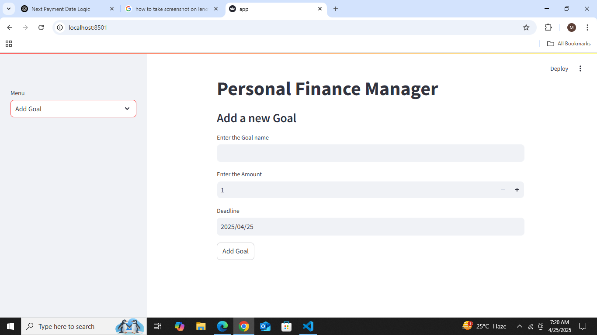
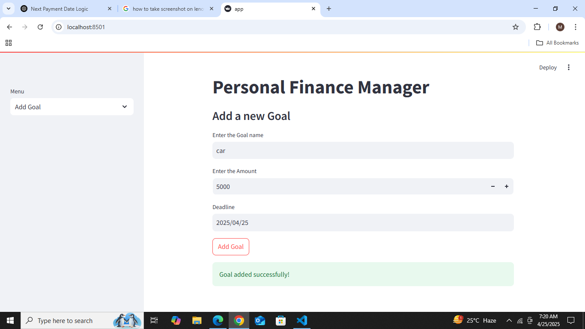
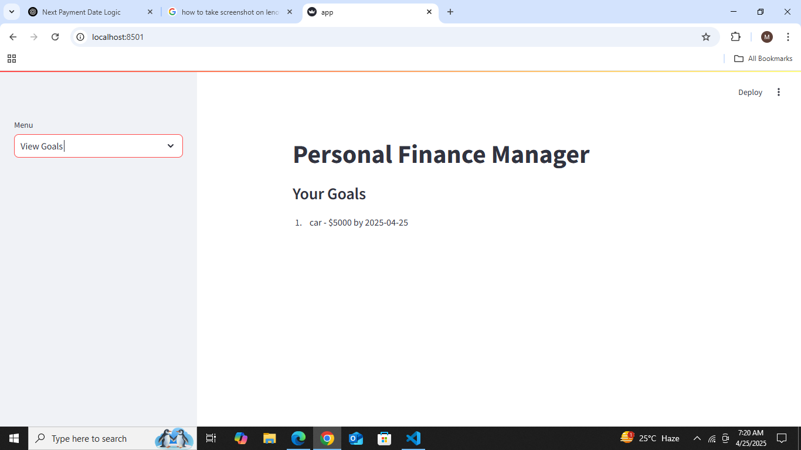
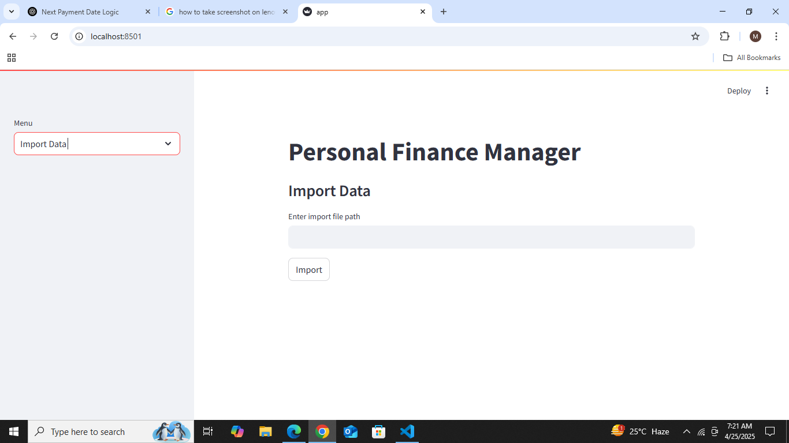
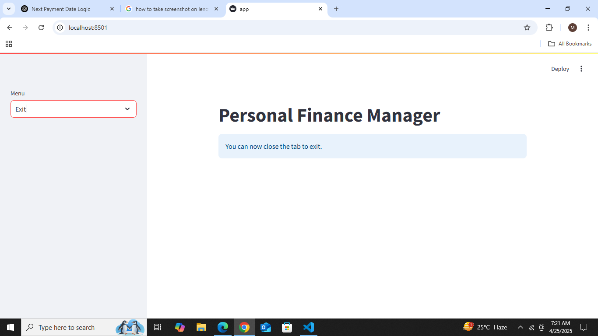

#  Personal Finance Manager

A simple and beginner-friendly application that helps users manage their finances effectively. This project was built entirely from scratch using **Python** and **Streamlit** to practice Object-Oriented Programming, modular code design, and building a basic UI.

---

##  Description

Personal Finance Manager allows users to:

- Set and track financial goals
- Import and export data
- View and manage their goals
- Handle data easily with a simple Streamlit interface

The project started as a console application and later upgraded with a web-based interface using Streamlit.

---

##  Project Structure

personal_finance_manager/ ├── main.py ├── app.py ├── core/ │ ├── account.py │ ├── transaction.py │ ├── budget.py │ ├── goal.py │ ├── category.py │ └── user_profile.py ├── services/ │ ├── report_generator.py │ ├── projection_calculator.py │ └── notification_manager.py ├── data/ │ └── data_manager.py ├── utils/ │ └── utils.py ├── ui/ │ └── console_ui.py └── assets/ ├── add_goal.png ├── goal_success.png ├── view_goals.png ├── import_data.png ├── export_data.png ├── exit.png

---

##  Features

-  Add and manage financial goals
-  View existing goals
-  Import data from a file
-  Export current data to a file
-  Confirmation after adding goals
-  Exit application smoothly

---

##  Technologies Used

- Python
- Streamlit
- OOP (Object-Oriented Programming)
- File Handling with JSON

---

##  How to Run

1. Clone the repository
2. Navigate to the project folder
3. Run this command in terminal:

```bash
streamlit run app.py
```

##  Screenshots

### Add Goal Interface

This screenshot shows the Streamlit form where users can input a goal name, target amount, and deadline.



---

###  Goal Added Successfully

This shows confirmation after a goal is added and saved successfully.



---

###  View Goals

This screenshot displays the list of all saved goals with their names, target amounts, and deadlines.



---

###  Import Data

This screenshot shows the interface where the user can enter a file path to import current financial data from a JSON file.



---

###  Export Data

This screenshot shows the interface where the user can enter a file path to export current financial data to a JSON file.


---

###  Exit Application

A simple message confirming the user has exited the application.



##  Author

Made with dedication by a beginner learning Python and Streamlit.  
This project was a self-initiated learning experience — designed, developed, and tested independently.
